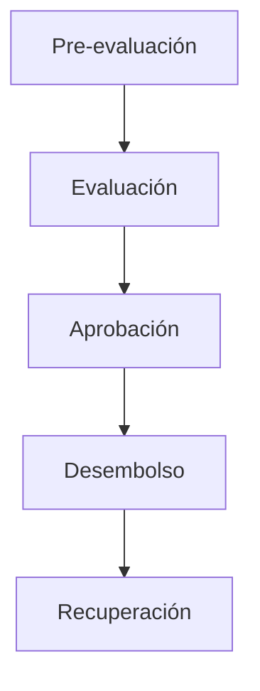
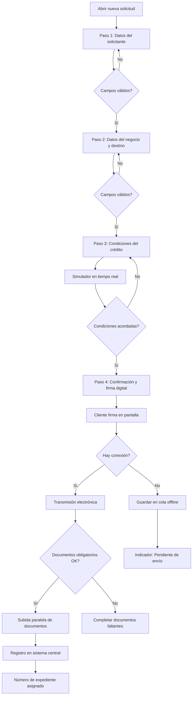
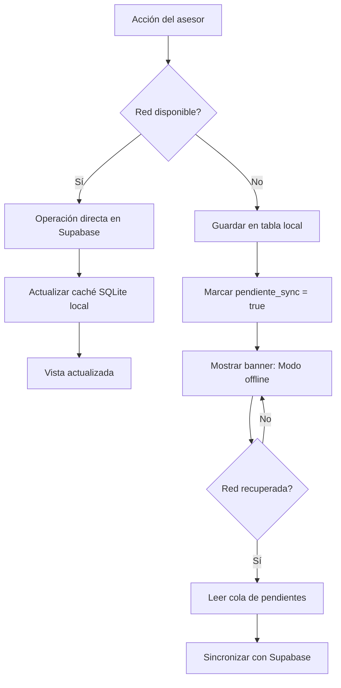
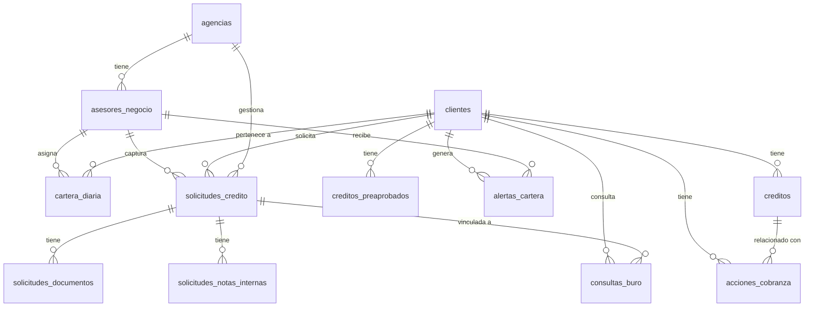

# App Fuerza de Ventas - Oficiales de Crédito en Campo

**Contexto del negocio**
El asesor de negocios sale diariamente al campo para visitar microempresas, negocios rurales y clientes individuales. La app reemplaza el expediente físico: descarga automáticamente la cartera del día desde el sistema central, permite registrar solicitudes en campo sin internet, captura fotos de documentos, consulta el buró de crédito y transmite electrónicamente la solicitud completa al comité de evaluación.

El ciclo completo sigue cinco etapas:
**Pre-evaluación → Evaluación → Aprobación → Desembolso → Recuperación**

Cada estudiante adapta marca, colores y productos a la entidad financiera asignada. El flujo de negocio es idéntico para todas las instituciones de microfinanzas.

---

## 📌 Módulos y Épicas

| Módulo | Épica                           | Historias de Usuario | Requerimientos Funcionales |
| ------ | ------------------------------- | -------------------- | -------------------------- |
| M0     | Autenticación y perfiles        | HU-01 a HU-03        | RF-01 a RF-08              |
| M1     | Cartera diaria                  | HU-04 a HU-07        | RF-09 a RF-18              |
| M2     | Planificación de ruta           | HU-08 a HU-10        | RF-19 a RF-26              |
| M3     | Ficha del cliente               | HU-11 a HU-14        | RF-27 a RF-36              |
| M4     | Pre-evaluación y prospección    | HU-15 a HU-16        | RF-37 a RF-42              |
| M5     | Captura de solicitud de crédito | HU-17 a HU-20        | RF-43 a RF-54              |
| M6     | Captura de documentos           | HU-21 a HU-22        | RF-55 a RF-60              |
| M7     | Consulta de buró y listas       | HU-23 a HU-24        | RF-61 a RF-66              |
| M8     | Transmisión electrónica         | HU-25 a HU-26        | RF-67 a RF-72              |
| M9     | Estado de solicitudes           | HU-27 a HU-29        | RF-73 a RF-79              |
| M10    | Recuperación de cartera vencida | HU-30 a HU-31        | RF-80 a RF-84              |
| M11    | Reportes y supervisión          | HU-32 a HU-33        | RF-85 a RF-90              |

---

## 🔐 M0 - Autenticación y perfiles

### HU-01: Login del asesor de negocios

**Como** asesor de negocios,
**Quiero** iniciar sesión con mi código de empleado y contraseña,
**Para** acceder únicamente a las funciones que corresponden a mi perfil desde el dispositivo móvil.

#### Criterios de aceptación

- El formulario solicita código de empleado (numérico) y contraseña con opción de mostrar/ocultar.
- Al autenticar correctamente, la sesión persiste. El asesor no repite login cada día.
- Al superar 5 intentos fallidos, el acceso se bloquea 30 minutos con cuenta regresiva visible.
- La sesión expira si el dispositivo permanece inactivo más de 8 horas.
- No es posible navegar al interior de la app sin haberse autenticado.

**Story Points:** 5
**Perfil:** Operador (asesor de negocios y auxiliar de créditos en campo)

#### Requerimientos Funcionales

| ID    | Descripción                                                                                                                                                                                                                                                       |
| ----- | ----------------------------------------------------------------------------------------------------------------------------------------------------------------------------------------------------------------------------------------------------------------- |
| RF-01 | Formulario de login con campo de código de empleado (teclado numérico), campo de contraseña con alternancia ver/ocultar, botón "Ingresar" y enlace "Problemas para ingresar". Las cuentas son creadas únicamente por el Administrador; no existe registro propio. |
| RF-02 | El sistema convierte el código de empleado en un identificador de correo interno para autenticar contra **Supabase Auth**. El token de sesión se almacena de forma segura y encriptada en el dispositivo.                                                         |
| RF-03 | Persistencia y renovación de sesión: Al relanzar la app con sesión vigente, navega directamente al Dashboard sin pasar por login. El token se renueva automáticamente antes de expirar.                                                                           |
| RF-04 | Bloqueo por intentos fallidos: Un contador local incrementa en cada error de autenticación. Al llegar a 5, el botón se deshabilita con un temporizador visible de 30 minutos. El bloqueo persiste aunque se cierre y reabra la app.                               |

---

### HU-02: Perfiles de acceso diferenciados

**Como** administrador de agencia,
**Quiero** que cada usuario vea solo las funciones correspondientes a su perfil,
**Para** mantener el control de acceso y evitar operaciones no autorizadas.

#### Criterios de aceptación

- El sistema maneja cuatro perfiles: **Operador**, **Super Operador**, **Supervisor** y **Administrador**.
- **Operador**: Accede a Cartera, Ruta, Ficha, Solicitud y Documentos.
- **Supervisor**: Accede adicionalmente a Reportes, Reasignación de tareas y Monitor en mapa.
- **Administrador**: Accede a todo, incluyendo gestión de usuarios y configuración.
- El perfil se obtiene del token de sesión y no puede modificarse desde el dispositivo.

**Story Points:** 3

#### Requerimientos Funcionales

| ID    | Descripción                                                                                                                                                                         |
| ----- | ----------------------------------------------------------------------------------------------------------------------------------------------------------------------------------- |
| RF-05 | Menú lateral adaptativo por perfil: muestra únicamente las opciones habilitadas para el perfil autenticado. Las opciones no autorizadas no aparecen; no se muestran deshabilitadas. |
| RF-06 | Roles y sus capacidades (ver tabla a continuación).                                                                                                                                 |

##### Tabla de Roles y Capacidades

| Perfil         | Capacidades principales                                                   |
| -------------- | ------------------------------------------------------------------------- |
| Operador       | Captura de tareas en campo. Solo móvil.                                   |
| Super Operador | Operador + jefe de comité en campo. Acceso a reportes de supervisión web. |
| Supervisor     | Administrador de agencia. Gestiona tareas, visualiza reportes y reasigna. |
| Administrador  | Todo lo anterior + gestión de usuarios, formularios y configuración.      |

---

### HU-03: Cierre de sesión y borrado de datos sensibles

**Como** asesor de negocios,
**Quiero** cerrar sesión desde el menú lateral,
**Para** que mis datos de cartera no sean accesibles si otra persona toma el dispositivo.

#### Criterios de aceptación

- El menú lateral siempre muestra la opción "Cerrar sesión".
- Al confirmar, se invalida el token en el servidor y se eliminan sesión y cartera en caché local.
- La app navega a la pantalla de login sin posibilidad de volver atrás.
- Si existen solicitudes pendientes de envío, se muestra aviso: "Tienes X solicitudes sin sincronizar. ¿Cerrar de todas formas?".

**Story Points:** 3

#### Requerimientos Funcionales

| ID    | Descripción                                                                                                                                                                                                                             |
| ----- | --------------------------------------------------------------------------------------------------------------------------------------------------------------------------------------------------------------------------------------- |
| RF-07 | Flujo de cierre de sesión: Secuencia al confirmar logout: invalidar token en Supabase, borrar token local, borrar tablas de cartera y fichas en caché, navegar a login limpiando el historial de navegación.                            |
| RF-08 | Advertencia de documentos pendientes: Antes de cerrar sesión, consultar la cola de solicitudes con `pendiente_sync = true`. Si el conteo es mayor a cero, mostrar diálogo de confirmación con el número exacto de registros pendientes. |

---

## 📋 M1 - Cartera diaria

### HU-04: Ver la lista de cartera asignada del día

**Como** asesor de negocios,
**Quiero** ver al iniciar el día la lista completa de clientes asignados a mí,
**Para** planificar visitas sin depender de conexión a internet durante el día.

#### Criterios de aceptación

- La lista muestra por cada cliente: nombre, documento censurado (`***456`), tipo de gestión con etiqueta de color, monto del crédito y nivel de prioridad (**ALTA / MEDIA / NORMAL**).
- Un indicador en el encabezado muestra: "15 clientes · 4 visitados · 11 pendientes".
- Los clientes visitados se desplazan al fondo con fondo gris y marca de completado.
- Una barra de progreso muestra el avance del día (visitados sobre total).
- Los datos están disponibles sin conexión desde la última sincronización.

**Story Points:** 8

#### Requerimientos Funcionales

| ID    | Descripción                                                                                                                                                                                                                                                                                        |
| ----- | -------------------------------------------------------------------------------------------------------------------------------------------------------------------------------------------------------------------------------------------------------------------------------------------------- |
| RF-09 | Consulta de cartera desde Supabase: Al iniciar sesión o al pulsar "Actualizar", la app consulta la tabla `cartera_diaria` filtrando por `asesor_id` y `fecha_asignacion` igual a la fecha actual, ordenando por `score_prioridad` descendente. El resultado se guarda localmente para uso offline. |
| RF-10 | Tipos de gestión y colores de etiqueta (ver tabla a continuación).                                                                                                                                                                                                                                 |
| RF-11 | Filtros de cartera: Fila de filtros con opciones: **Todos / Renovaciones / Nuevas / En mora / Visitados**. El filtrado opera sobre los datos locales sin necesidad de nueva consulta a red. El contador del encabezado se actualiza con el subconjunto filtrado.                                   |
| RF-12 | Búsqueda rápida: Campo de búsqueda con retraso de 300 ms. Busca por nombre completo o últimos cuatro dígitos del documento contra los datos en caché local.                                                                                                                                        |

##### Tipos de Gestión y Colores

| Tipo              | Color   | Descripción                                   |
| ----------------- | ------- | --------------------------------------------- |
| RENOVACIÓN        | Azul    | Crédito vigente próximo a vencer              |
| AMPLIACIÓN        | Verde   | Cliente solicita incremento de monto          |
| NUEVA SOLICITUD   | Naranja | Prospecto o cliente nuevo                     |
| SEGUIMIENTO       | Gris    | Visita de control post-desembolso             |
| RECUPERACIÓN MORA | Rojo    | Cliente con cuotas vencidas                   |
| DESERTOR          | Morado  | Cliente que dejó de operar con la institución |

---

### HU-05: Descarga automática nocturna de cartera

**Como** asesor de negocios,
**Quiero** que la app descargue mi cartera del día siguiente cada noche automáticamente,
**Para** llegar al campo con todos los datos disponibles sin esperar sincronización.

#### Criterios de aceptación

- Una tarea programada ejecuta la sincronización a las **22:00 horas** todos los días.
- La sincronización descarga: cartera asignada, fichas de clientes, últimos tres meses de movimientos y preaprobados vigentes.
- Al completar, envía notificación: "Tu cartera de mañana está lista: X clientes."
- Si falla, reintenta a las 22:30 y 23:00 con incremento progresivo de espera.
- El encabezado de Cartera muestra: "Última actualización: hoy 22:03".

**Story Points:** 5

#### Requerimientos Funcionales

| ID    | Descripción                                                                                                                                                                                                                                             |
| ----- | ------------------------------------------------------------------------------------------------------------------------------------------------------------------------------------------------------------------------------------------------------- |
| RF-13 | Tarea programada de sincronización nocturna: Usar **WorkManager en Flutter** (`workmanager` package). Tarea periódica diaria programada para las 22:00 horas con restricción de red activa. Política de reintento exponencial con máximo tres intentos. |
| RF-14 | Notificación push local al completar: Al terminar la sincronización, emitir una notificación local con el número de clientes cargados y enlace directo a la pantalla de Cartera.                                                                        |

---

### HU-06: Segmentación y priorización automática de visitas

**Como** asesor de negocios,
**Quiero** que el sistema indique qué clientes son más urgentes cada día,
**Para** maximizar el impacto de mis visitas según los objetivos de la agencia.

#### Criterios de aceptación

- La cartera se ordena automáticamente por: mora vencida primero, luego renovaciones de alto monto, ampliaciones, seguimiento y nuevas solicitudes.
- Un puntaje de prioridad (0 a 100) determina el orden de cada cliente.
- El asesor puede reordenar manualmente su lista arrastrando elementos.
- El reordenamiento manual persiste localmente y no afecta la asignación del sistema central.

**Story Points:** 5

#### Requerimientos Funcionales

| ID    | Descripción                                                                       |
| ----- | --------------------------------------------------------------------------------- |
| RF-15 | Lógica de puntaje de prioridad: El puntaje se calcula localmente con estos pesos: |

- Mora activa: **40 puntos base + días de mora** (hasta 30 puntos adicionales).
- Renovación con monto mayor a S/5,000: **35 puntos**.
- Ampliación: **25 puntos**.
- Seguimiento: **10 puntos**.
- Nueva solicitud: **5 puntos**.
  Máximo: **100 puntos**. |
  | RF-16 | Reordenamiento manual con arrastrar y soltar: La pantalla de cartera permite reorganizar la lista arrastrando cada elemento. El nuevo orden se guarda localmente en la tabla `cartera_orden_local`. |

---

### HU-07: Marcar visita como completada

**Como** asesor de negocios,
**Quiero** registrar el resultado de cada visita al salir de la ficha del cliente,
**Para** llevar control del avance del día y que mi supervisor lo vea en tiempo real.

#### Criterios de aceptación

- Al salir de la ficha del cliente, un panel inferior ofrece: **Visitado / No encontrado / Reagendar / Negocio cerrado**.
- Cada resultado incluye campo de observación libre (máximo 200 caracteres).
- Al confirmar, el elemento cambia visualmente y se actualiza en Supabase con marca de tiempo y coordenadas GPS del momento.
- Sin conexión, el cambio queda en cola local y se sincroniza al reconectar.
- El supervisor ve el cambio en tiempo real en el portal web.

**Story Points:** 5

#### Requerimientos Funcionales

| ID    | Descripción                                                                                                                                                                                                                                                                                           |
| ----- | ----------------------------------------------------------------------------------------------------------------------------------------------------------------------------------------------------------------------------------------------------------------------------------------------------- |
| RF-17 | Registro de resultado de visita: Al confirmar el resultado, el sistema envía a Supabase los campos: `estado_visita`, `resultado_visita`, `observacion_visita`, `timestamp_visita`, `lat_visita` y `lng_visita`. Sin conexión, guarda en tabla local `visitas_pendientes` con `pendiente_sync = true`. |
| RF-18 | Sincronización de visitas pendientes al reconectar: El monitor de red detecta la reconexión y dispara la sincronización de todas las filas con `pendiente_sync = true`, enviándolas en lote a Supabase y marcando cada una como sincronizada al completar.                                            |

---

## 🗺️ M2 - Planificación de ruta

### HU-08: Ver mapa de visitas del día con ruta optimizada

**Como** asesor de negocios,
**Quiero** ver un mapa con todos mis clientes del día y una ruta sugerida,
**Para** reducir tiempo de desplazamiento y visitar más clientes.

#### Criterios de aceptación

- El mapa muestra un marcador por cliente con color según prioridad: **rojo (ALTA)**, **amarillo (MEDIA)**, **verde (NORMAL)**.
- Al tocar un marcador, aparece una ficha rápida con nombre, tipo de gestión y botón "Ver ficha completa".
- El botón "Optimizar ruta" reordena los marcadores por distancia y tiempo desde la posición actual.
- La ruta óptima se dibuja como línea conectando los puntos en orden.
- El botón "Navegar" lanza **Waze** o **Google Maps** con el primer destino.
- Los clientes ya visitados cambian su marcador a gris con marca de completado.

**Story Points:** 8

#### Requerimientos Funcionales

| ID    | Descripción                                                                                                                                                                                                                                                                                          |
| ----- | ---------------------------------------------------------------------------------------------------------------------------------------------------------------------------------------------------------------------------------------------------------------------------------------------------- |
| RF-19 | Integración de Google Maps en Flutter: Uso del paquete `google_maps_flutter`. Los marcadores se crean con color diferenciado por prioridad. La polilínea de ruta óptima se dibuja sobre el mapa como capa adicional.                                                                                 |
| RF-20 | Permisos de ubicación: La app solicita permiso de ubicación precisa al abrir el módulo de ruta. Si el usuario deniega, se muestra explicación clara de por qué es necesario. Sin permiso, el mapa funciona pero sin posición actual ni optimización de ruta.                                         |
| RF-21 | Algoritmo de optimización de ruta: Algoritmo del vecino más cercano: parte desde la posición actual del asesor, en cada paso elige el cliente no visitado más próximo por distancia euclidiana, hasta cubrir toda la cartera. El resultado se presenta como lista reordenada y polilínea en el mapa. |
| RF-22 | Lanzar app de navegación externa: Al pulsar "Navegar", la app intenta abrir **Waze** con las coordenadas del destino. Si Waze no está instalado, abre **Google Maps**. Si ninguna está disponible, abre el navegador con Google Maps web.                                                            |

---

### HU-09: Gestionar geocercas por zona de trabajo

**Como** administrador de agencia,
**Quiero** definir zonas geográficas para cada asesor,
**Para** organizar la fuerza comercial por sectores y medir cobertura real.

#### Criterios de aceptación

- El mapa permite definir polígonos que delimitan zonas de trabajo.
- Cada zona tiene nombre, color distintivo y lista de asesores asignados.
- El asesor ve el contorno de su zona como capa semitransparente en su mapa.
- Si el asesor registra una visita fuera de su zona, el sistema muestra un aviso (no bloquea).

**Story Points:** 5

#### Requerimientos Funcionales

| ID    | Descripción                                                                                                                                                                                                                                                                                        |
| ----- | -------------------------------------------------------------------------------------------------------------------------------------------------------------------------------------------------------------------------------------------------------------------------------------------------- |
| RF-23 | Capa de geocerca en el mapa: El polígono de la zona se renderiza como capa de relleno semitransparente sobre el mapa con borde del color asignado a la zona.                                                                                                                                       |
| RF-24 | Detección de visita fuera de zona: Antes de guardar el resultado de una visita, se compara la ubicación GPS actual con el polígono de zona usando el algoritmo de rayo (**Ray Casting**). Si está fuera, aparece un aviso: "Esta visita está fuera de tu zona asignada. Se registrará igualmente." |

---

### HU-10: Registrar coordenadas GPS del negocio del cliente

**Como** asesor de negocios,
**Quiero** capturar y actualizar la ubicación exacta del negocio del cliente durante la visita,
**Para** que futuras visitas y el mapa del equipo sean más precisos.

#### Criterios de aceptación

- En la ficha del cliente, el botón "Actualizar ubicación del negocio" captura las coordenadas actuales.
- Se muestra la dirección aproximada obtenida por geocodificación inversa.
- El asesor puede confirmar o descartar la ubicación capturada.
- Al confirmar, se actualizan las coordenadas del cliente en Supabase.

**Story Points:** 3

#### Requerimientos Funcionales

| ID    | Descripción                                                                                                                                                                                                      |
| ----- | ---------------------------------------------------------------------------------------------------------------------------------------------------------------------------------------------------------------- |
| RF-25 | Captura de coordenadas con GPS de alta precisión: Uso del paquete `geolocator` con precisión alta. La captura se realiza al momento de pulsar el botón, mostrando indicador de carga mientras obtiene la señal.  |
| RF-26 | Geocodificación inversa: Uso del paquete `geocoding` para convertir coordenadas en dirección legible: calle, distrito, ciudad. Se muestra como texto editable para que el asesor pueda corregir si es necesario. |

---

## 📄 M3 - Ficha del cliente

### HU-11: Ver ficha completa del cliente antes de la visita

**Como** asesor de negocios,
**Quiero** consultar toda la información del cliente antes de visitarlo,
**Para** llegar preparado con datos actualizados sin depender de papeles.

#### Criterios de aceptación

- La ficha muestra: foto o iniciales, nombre completo, documento, dirección, teléfono, tipo y antigüedad del negocio.
- Sección "Posición del cliente": deuda total en el sistema, cuotas al día, cuotas en mora, fecha del último pago.
- Sección "Historial crediticio": últimos cinco créditos con monto, plazo, tasa, estado y porcentaje de pagos puntuales.
- Sección "Oferta vigente": monto preaprobado por el sistema de scoring (si existe).
- Botón "Llamar" abre el marcador telefónico con el número del cliente prellenado.
- Los datos se cargan desde caché si no hay conexión.

**Story Points:** 8

#### Requerimientos Funcionales

| ID    | Descripción                                                                                                                                                                                                                                                   |
| ----- | ------------------------------------------------------------------------------------------------------------------------------------------------------------------------------------------------------------------------------------------------------------- |
| RF-27 | Estructura de la pantalla de ficha: La pantalla usa desplazamiento vertical con secciones apiladas: encabezado del cliente, datos de contacto y negocio, posición en el sistema, historial de créditos, oferta preaprobada y botonera de acciones.            |
| RF-28 | Semáforo de riesgo crediticio (ver tabla a continuación).                                                                                                                                                                                                     |
| RF-29 | Llamada directa desde la ficha: El botón "Llamar" lanza la app telefónica del dispositivo con el número del cliente. No realiza la llamada automáticamente; el asesor confirma desde el marcador.                                                             |
| RF-30 | Consulta de posición del cliente: Se invoca una **Supabase Edge Function** `consulta-posicion` que devuelve: deuda total consolidada, número de cuentas vigentes, número de cuentas en mora, días de mayor mora histórica y fecha del último pago registrado. |

##### Semáforo de Riesgo Crediticio

| Calificación SBS                | Color del semáforo | Descripción              |
| ------------------------------- | ------------------ | ------------------------ |
| Normal                          | Verde              | Sin observaciones        |
| CPP (Con Problemas Potenciales) | Amarillo           | Requiere atención        |
| Deficiente                      | Naranja            | Requiere comité especial |
| Dudoso                          | Rojo               | Alto riesgo              |
| Pérdida                         | Gris oscuro        | No procede evaluación    |

---

### HU-12: Ver gráfico de comportamiento de pagos

**Como** asesor de negocios,
**Quiero** ver un gráfico mensual del comportamiento de pagos del cliente en los últimos 12 meses,
**Para** evaluar visualmente si es candidato a una nueva operación antes de proponer algo.

#### Criterios de aceptación

- Gráfico de barras con 12 columnas: **verde = pago puntual**, **rojo = pago con mora**, **gris = sin cuota ese mes**.
- Indicadores debajo del gráfico: porcentaje de pagos puntuales, días promedio de mora, monto total pagado.
- El gráfico funciona offline con datos descargados en la sincronización nocturna.

**Story Points:** 5

#### Requerimientos Funcionales

| ID    | Descripción                                                                                                                                                                                                                                                                                     |
| ----- | ----------------------------------------------------------------------------------------------------------------------------------------------------------------------------------------------------------------------------------------------------------------------------------------------- |
| RF-31 | Gráfico de comportamiento con `fl_chart`: Uso del paquete `fl_chart` para el gráfico de barras. El color de cada barra se determina según el estado de pago del período: verde para pago puntual, rojo para pago con mora, gris para períodos sin cuota. El eje X muestra los meses abreviados. |
| RF-32 | Cálculo de indicadores de comportamiento: Los indicadores se calculan en el ViewModel a partir de los datos locales:                                                                                                                                                                            |

- **Porcentaje puntual**: cuotas al día entre total de cuotas × 100.
- **Días promedio de mora**: suma de días de mora en cuotas morosas entre número de cuotas morosas.
- **Monto total pagado**: suma de todos los montos pagados registrados. |

---

### HU-13: Ver oferta preaprobada del scoring

**Como** asesor de negocios,
**Quiero** ver el monto máximo preaprobado calculado por el sistema antes de la visita,
**Para** llegar con una propuesta concreta en lugar de generar expectativas sin respaldo.

#### Criterios de aceptación

- La sección "Oferta vigente" muestra: monto máximo, plazo sugerido, tasa TEA referencial, nivel de confianza del puntaje y fecha de vencimiento de la oferta.
- Si no existe preaprobado, muestra: "Sin oferta vigente. Puede iniciar solicitud nueva."
- El botón "Usar esta oferta" prellena el formulario de solicitud con esos datos.

**Story Points:** 5

#### Requerimientos Funcionales

| ID    | Descripción                                                                                                                                                                                                                                                                                              |
| ----- | -------------------------------------------------------------------------------------------------------------------------------------------------------------------------------------------------------------------------------------------------------------------------------------------------------- |
| RF-33 | Consulta de preaprobados vigentes: Se consulta la tabla `creditos_preaprobados` filtrando por `cliente_id`, `vigente = true` y `fecha_vencimiento` mayor o igual a la fecha actual. Se toma el registro con mayor `score_confianza`.                                                                     |
| RF-34 | Tarjeta visual de oferta preaprobada: La tarjeta usa fondo verde claro con borde verde. Muestra monto formateado, plazo en meses, tasa TEA en porcentaje, barra horizontal de confianza del puntaje y fecha de vigencia. El botón de acción lleva al formulario de solicitud con los campos prellenados. |

---

### HU-14: Recibir alertas de caída de cartera

**Como** asesor de negocios,
**Quiero** recibir alertas cuando un cliente entra en mora o tiene variaciones importantes,
**Para** actuar de forma preventiva antes de que el crédito se deteriore.

#### Criterios de aceptación

- Las alertas muestran una insignia numérica sobre el icono de cartera en el menú.
- Tipos de alerta: **primer día de mora**, **mora mayor a 30 días**, **mora mayor a 60 días**, **pago parcial**, **pago total**.
- Al tocar una alerta, navega directamente a la ficha del cliente correspondiente.
- Las alertas leídas se marcan y desaparecen de la insignia al día siguiente.

**Story Points:** 5

#### Requerimientos Funcionales

| ID    | Descripción                                                                                                                                                                                                                                                               |
| ----- | ------------------------------------------------------------------------------------------------------------------------------------------------------------------------------------------------------------------------------------------------------------------------- |
| RF-35 | Suscripción Realtime para alertas: La app se suscribe al canal Realtime de Supabase para inserciones en la tabla `alertas_cartera` donde `asesor_id` coincide con el usuario autenticado. Al recibir un evento, actualiza el estado del ViewModel y refresca la insignia. |
| RF-36 | Insignia numérica en menú: El número de alertas no leídas se muestra como insignia roja sobre el icono de campana en el menú lateral. Se actualiza en tiempo real al recibir nuevas alertas o al marcar las existentes como leídas.                                       |

---

## 🔍 M4 - Pre-evaluación y prospección

### HU-15: Pre-evaluar a un prospecto en campo

**Como** asesor de negocios,
**Quiero** registrar datos básicos de un prospecto y obtener una pre-evaluación crediticia en campo,
**Para** saber si el prospecto califica antes de iniciar el proceso formal.

#### Criterios de aceptación

- El formulario captura: documento, nombres, tipo de negocio, ingresos estimados, destino del crédito y monto solicitado.
- Al pulsar "Pre-evaluar", el sistema consulta la posición del prospecto en el sistema financiero.
- El resultado indica: **APTO** (continuar evaluación), **REVISAR** (requiere análisis adicional) o **NO PROCEDE**.
- Si está apto, el botón "Iniciar solicitud formal" abre el formulario completo con datos prellenados.
- Sin conexión, la pre-evaluación queda en cola y se procesa al reconectar.

**Story Points:** 8

#### Requerimientos Funcionales

| ID    | Descripción                                                                                                                                                                                                                                                                                                            |
| ----- | ---------------------------------------------------------------------------------------------------------------------------------------------------------------------------------------------------------------------------------------------------------------------------------------------------------------------- |
| RF-37 | Formulario de prospección: Campos requeridos: número de documento (8 dígitos), nombres, apellidos, fecha de nacimiento, tipo de negocio (lista desplegable), antigüedad del negocio en años y meses, ingresos estimados mensuales, monto solicitado (control deslizante entre S/500 y S/50,000) y destino del crédito. |
| RF-38 | Consulta en línea al sistema de pre-evaluación: Se invoca la **Edge Function** `pre-evaluar` con los datos del prospecto. La función devuelve: calificación (**APTO / REVISAR / NO PROCEDE**), motivo en caso de restricción y puntaje interno estimado.                                                               |
| RF-39 | Presentación visual del resultado de pre-evaluación (ver tabla a continuación).                                                                                                                                                                                                                                        |

##### Resultado de Pre-evaluación

| Resultado  | Color de fondo | Etiqueta visible              | Acción disponible        |
| ---------- | -------------- | ----------------------------- | ------------------------ |
| APTO       | Verde          | Puede continuar la evaluación | Iniciar solicitud formal |
| REVISAR    | Amarillo       | Requiere análisis adicional   | Registrar observaciones  |
| NO PROCEDE | Rojo           | No cumple condiciones         | Informar al cliente      |

---

### HU-16: Gestionar campañas de renovaciones y ampliaciones

**Como** asesor de negocios,
**Quiero** ver los clientes con oferta de renovación o ampliación activa en mi cartera,
**Para** gestionar campañas comerciales sin perder oportunidades del período.

#### Criterios de aceptación

- Una sección "Campañas activas" en el dashboard muestra las ofertas vigentes del período.
- Cada oferta indica: tipo (**renovación / ampliación / producto paralelo**), monto ofertado, fecha de vencimiento y cliente al que aplica.
- Al gestionar una oferta en campo, el sistema inicia el proceso de solicitud con datos prellenados.
- Las ofertas expiradas se marcan automáticamente como vencidas al día siguiente.

**Story Points:** 5

#### Requerimientos Funcionales

| ID    | Descripción                                                                                                                                                                                                                                                          |
| ----- | -------------------------------------------------------------------------------------------------------------------------------------------------------------------------------------------------------------------------------------------------------------------- |
| RF-40 | Consulta de campañas activas: Se consulta la tabla `campanas_activas` filtrando por `asesor_id`, `activa = true` y `fecha_vencimiento` mayor o igual a hoy. Los resultados se ordenan por fecha de vencimiento ascendente para priorizar las más próximas a expirar. |
| RF-41 | Tarjeta de campaña activa: Cada campaña muestra: etiqueta del tipo con color diferenciado, nombre del cliente, monto de la oferta formateado, cuenta regresiva de días restantes y botón "Gestionar ahora".                                                          |
| RF-42 | Registro de cliente desertor: Para clientes desertores, el formulario captura: motivo de deserción (lista predefinida), institución a la que migró (si se conoce), probabilidad de retorno (**Alta / Media / Baja**) y observaciones libres.                         |

---

## 📝 M5 - Captura de solicitud de crédito en campo

### HU-17: Registrar solicitud de crédito en cuatro pasos (offline-first)

**Como** asesor de negocios,
**Quiero** capturar la solicitud de crédito completa del cliente directamente en su negocio,
**Para** iniciar el proceso de evaluación sin regresar a la agencia.

#### Criterios de aceptación

- El formulario tiene cuatro pasos secuenciales: **Datos del solicitante**, **Datos del negocio**, **Condiciones del crédito**, **Confirmación y firma**.
- Cada paso valida sus campos antes de permitir avanzar. Los campos obligatorios no completados se resaltan en rojo.
- El asesor puede guardar borrador en cualquier paso y retomarlo después.
- Con conexión, la solicitud se envía al instante. Sin conexión, queda en cola con indicador "Pendiente de envío".
- Al enviar, se genera un número de expediente local visible al asesor.
- El formulario se adapta según el tipo de producto: **microcrédito** (comercio, productivo o servicio) o **consumo**.

**Story Points:** 13

#### Requerimientos Funcionales

| ID    | Descripción                                                                                                                                                                                                                                                                                                                                  |
| ----- | -------------------------------------------------------------------------------------------------------------------------------------------------------------------------------------------------------------------------------------------------------------------------------------------------------------------------------------------- |
| RF-43 | Indicador de progreso de cuatro pasos: El encabezado del formulario muestra los cuatro pasos con estado visual: **completado** (relleno), **activo** (borde destacado) o **pendiente** (vacío). La navegación entre pasos usa botones "Anterior" y "Siguiente"; el deslizamiento lateral está deshabilitado para evitar saltar validaciones. |
| RF-44 | Paso 1: Datos del solicitante (ver tabla a continuación).                                                                                                                                                                                                                                                                                    |
| RF-45 | Paso 2: Datos del negocio y destino del crédito (ver tabla a continuación).                                                                                                                                                                                                                                                                  |
| RF-46 | Paso 3: Condiciones del crédito (ver tabla a continuación).                                                                                                                                                                                                                                                                                  |
| RF-47 | Fórmula de simulación de cuota en tiempo real: La cuota mensual se calcula con la fórmula de amortización francesa:                                                                                                                                                                                                                          |

- **Tasa mensual equivalente** = `(1 + TEA) ^ (1/12) - 1`
- **Cuota mensual** = `Monto × Tasa mensual / (1 - (1 + Tasa mensual) ^ (-Plazo en meses))`
  El cálculo es síncrono en el ViewModel y no requiere conexión a red. |
  | RF-48 | Paso 4: Confirmación y firma digital: Vista de resumen en modo solo lectura con todos los datos ingresados. Lienzo táctil para que el cliente firme con el dedo. La firma se convierte a imagen y se adjunta a la solicitud. Casilla obligatoria: "El cliente declara que los datos son veraces". |

##### Paso 1: Datos del Solicitante

| Campo                | Tipo              | Validación                                          |
| -------------------- | ----------------- | --------------------------------------------------- |
| Nombres              | Texto             | Obligatorio, solo letras                            |
| Apellidos            | Texto             | Obligatorio                                         |
| Documento            | Numérico          | 8 dígitos exactos                                   |
| Fecha de nacimiento  | Selector de fecha | Edad entre 18 y 75 años                             |
| Estado civil         | Lista             | Soltero / Casado / Conviviente / Divorciado / Viudo |
| Grado de instrucción | Lista             | Primaria / Secundaria / Técnico / Universitario     |
| Teléfono             | Numérico          | 9 dígitos                                           |
| Correo electrónico   | Texto             | Formato válido (opcional)                           |

##### Paso 2: Datos del Negocio y Destino del Crédito

| Campo                        | Tipo                    | Validación                                       |
| ---------------------------- | ----------------------- | ------------------------------------------------ |
| Tipo de negocio              | Lista                   | Comercio / Servicios / Producción / Agropecuario |
| Nombre del negocio           | Texto                   | Obligatorio                                      |
| Dirección del negocio        | Texto                   | Obligatorio                                      |
| Antigüedad del negocio       | Numérico (años + meses) | Mínimo 6 meses                                   |
| Ingresos estimados mensuales | Decimal                 | Mayor que cero                                   |
| Gastos mensuales             | Decimal                 | Mayor o igual a cero                             |
| Patrimonio estimado          | Decimal                 | Opcional                                         |
| Destino del crédito          | Texto libre             | Máximo 500 caracteres                            |
| Actividad económica          | Lista                   | Según catálogo CIIU                              |

##### Paso 3: Condiciones del Crédito

| Campo            | Tipo               | Validación                                  |
| ---------------- | ------------------ | ------------------------------------------- |
| Monto solicitado | Control deslizante | Entre S/500 y S/150,000                     |
| Plazo            | Lista desplegable  | 3, 6, 12, 18, 24, 36, 48 o 60 meses         |
| Moneda           | Selector           | PEN o USD                                   |
| Tipo de cuota    | Selector           | Mensual, quincenal o semanal                |
| Garantía         | Lista              | Sin garantía, aval, hipotecaria o prendaria |

---

### HU-18: Guardar y retomar borradores de solicitud

**Como** asesor de negocios,
**Quiero** guardar una solicitud incompleta como borrador y retomarla después,
**Para** completarla en una segunda visita sin perder los datos ya ingresados.

#### Criterios de aceptación

- Al intentar salir del formulario, aparece diálogo: "Guardar borrador / Descartar / Cancelar".
- La pantalla "Borradores" lista las solicitudes incompletas con: nombre del cliente, paso alcanzado, fecha y monto.
- Al seleccionar un borrador, navega al paso donde se quedó con todos los campos prellenados.
- Deslizar un borrador hacia un lado y confirmar lo elimina permanentemente.

**Story Points:** 3

#### Requerimientos Funcionales

| ID    | Descripción                                                                                                                                                                                                                             |
| ----- | --------------------------------------------------------------------------------------------------------------------------------------------------------------------------------------------------------------------------------------- |
| RF-49 | Persistencia de borradores en SQLite local: Los borradores se guardan en la tabla local `solicitudes_borrador` con todos los campos del formulario serializados, el número de paso alcanzado y la marca de tiempo de la última edición. |

---

### HU-19: Simulador de crédito rápido independiente

**Como** asesor de negocios,
**Quiero** calcular rápidamente la cuota de cualquier monto y plazo sin abrir una solicitud formal,
**Para** responder al instante las preguntas del cliente durante la visita.

#### Criterios de aceptación

- Pantalla accesible desde el menú lateral y desde la ficha del cliente.
- Control deslizante de monto (S/500 a S/150,000) y selector de plazo.
- Cuota mensual, total a pagar y costo financiero se actualizan en tiempo real.
- Funciona completamente sin conexión.
- El botón "Crear solicitud con estos datos" navega al formulario con monto y plazo prellenados.

**Story Points:** 5

#### Requerimientos Funcionales

| ID    | Descripción                                                                                                                                                                                                                                                  |
| ----- | ------------------------------------------------------------------------------------------------------------------------------------------------------------------------------------------------------------------------------------------------------------ |
| RF-50 | Pantalla del simulador: Tres tarjetas de indicador con: cuota mensual, total a pagar y costo financiero. El cálculo usa la misma fórmula del formulario de solicitud (RF-47). El botón de acción pasa los parámetros como argumentos a la ruta de solicitud. |

---

### HU-20: Ver historial de mis solicitudes del mes

**Como** asesor de negocios,
**Quiero** ver todas las solicitudes que he registrado en el período,
**Para** hacer seguimiento y reportar mi productividad.

#### Criterios de aceptación

- Lista agrupada por semana con contador de cada estado.
- Encabezado con indicadores: total enviadas, aprobadas, desembolsadas y monto total del mes.
- Al tocar una solicitud, navega al detalle de su estado actual.

**Story Points:** 3

#### Requerimientos Funcionales

| ID    | Descripción                                                                                                                                                                                                                                                            |
| ----- | ---------------------------------------------------------------------------------------------------------------------------------------------------------------------------------------------------------------------------------------------------------------------- |
| RF-51 | Consulta de solicitudes del período: Se consulta la tabla `solicitudes_credito` filtrando por `asesor_id` y `created_at` dentro del mes actual, ordenando por fecha descendente.                                                                                       |
| RF-52 | Indicadores mensuales del asesor: Los indicadores se calculan desde el resultado de la consulta: total de filas enviadas, subconjunto con estado **aprobado**, subconjunto con estado **desembolsado**, suma de `monto_aprobado` y tasa de aprobación como porcentaje. |

---

## 📷 M6 - Captura de documentos

### HU-21: Fotografiar documentos del cliente con validación de nitidez

**Como** asesor de negocios,
**Quiero** capturar fotos de los documentos del cliente con validación de calidad automática,
**Para** evitar que documentos ilegibles rechacen la solicitud en el comité.

#### Criterios de aceptación

- Documentos obligatorios: **documento de identidad anverso**, **documento de identidad reverso**, **foto del negocio**, **foto del asesor con el cliente**.
- Documentos opcionales: **RUC**, **recibo de servicios**, **contrato de arriendo**.
- La app valida automáticamente la nitidez de cada foto antes de aceptarla.
- Cada foto se comprime automáticamente a un máximo de **800 KB** antes de subir.
- Un listado visual muestra el estado de cada documento: **LISTO / PENDIENTE / OBLIGATORIO**.
- El botón "Enviar solicitud" solo se activa cuando todos los obligatorios están en estado **LISTO**.

**Story Points:** 8

#### Requerimientos Funcionales

| ID    | Descripción                                                                                                                                                                                                                                                 |
| ----- | ----------------------------------------------------------------------------------------------------------------------------------------------------------------------------------------------------------------------------------------------------------- |
| RF-53 | Captura con `camera` package y marco guía: Uso del paquete `camera` de Flutter. La vista previa muestra un marco guía superpuesto indicando el tipo de documento esperado. La captura se realiza al pulsar el botón de la cámara en la pantalla de preview. |
| RF-54 | Compresión y validación de nitidez: Después de capturar, la imagen pasa por dos procesos:                                                                                                                                                                   |

1. \*\*Cálculo de la varianza del Laplaciano\*\* para detectar desenfoque: si el puntaje está por debajo del umbral configurado, se solicita retomar la foto.
2. \*\*Compresión iterativa\*\* reduciendo la calidad en pasos de 10 puntos hasta que el archivo sea menor a 800 KB.
   La imagen validada y comprimida se sube a \*\*Supabase Storage\*\* en la ruta \`documentos-solicitudes/{solicitud_id}/{tipo_documento}.jpg\`. |

---

### HU-22: Revisar y gestionar fotos adjuntas antes del envío

**Como** asesor de negocios,
**Quiero** revisar las fotos adjuntas y reemplazar las que no sean claras,
**Para** asegurar que el comité pueda leer todos los documentos sin problemas.

#### Criterios de aceptación

- Galería horizontal de miniaturas con el nombre del documento debajo de cada una.
- Al tocar una miniatura, se abre visor a pantalla completa con zoom de pinza.
- El botón "Retomar" en el visor permite reemplazar esa foto sin afectar las demás.
- El botón "Eliminar" muestra diálogo de confirmación antes de borrar.

**Story Points:** 3

#### Requerimientos Funcionales

| ID    | Descripción                                                                                                                                                                                                                                                                       |
| ----- | --------------------------------------------------------------------------------------------------------------------------------------------------------------------------------------------------------------------------------------------------------------------------------- |
| RF-55 | Visor de imágenes con zoom: Uso del paquete `photo_view` para el visor a pantalla completa con soporte de zoom mediante gesto de pinza.                                                                                                                                           |
| RF-56 | Eliminación de documento con confirmación: Al eliminar: borrar el archivo de Supabase Storage, eliminar el registro de la tabla `solicitudes_documentos` y actualizar la vista del listado. Si alguna operación falla, mostrar mensaje de error y revertir los cambios aplicados. |

---

## 🔎 M7 - Consulta de buró y listas negras

### HU-23: Consultar historial en centrales de riesgo en campo

**Como** asesor de negocios,
**Quiero** consultar el reporte crediticio del cliente durante la visita,
**Para** tomar una decisión informada sobre la solicitud sin regresar a la oficina.

#### Criterios de aceptación

- La consulta requiere **firma digital de consentimiento del cliente** (Ley de Protección de Datos Personales, Ley 29733).
- El resultado muestra: calificación SBS, número de entidades con deuda activa, deuda total en el sistema, mayor deuda individual y días de mayor mora histórica.
- El semáforo de resultado sigue la misma codificación que la ficha del cliente (RF-28).
- La consulta queda registrada con marca de tiempo como evidencia de auditoría.
- Si existe una consulta del mismo cliente realizada en los últimos **30 días**, el sistema ofrece reutilizar ese resultado para no impactar el historial del cliente.

**Story Points:** 8

#### Requerimientos Funcionales

| ID    | Descripción                                                                                                                                                                                                                                                                                                                                                                                   |
| ----- | --------------------------------------------------------------------------------------------------------------------------------------------------------------------------------------------------------------------------------------------------------------------------------------------------------------------------------------------------------------------------------------------- |
| RF-57 | Consentimiento previo a la consulta: Antes de ejecutar la consulta, se muestra el texto legal de autorización completo. El cliente firma en el lienzo táctil. La firma y la marca de tiempo se guardan como evidencia junto al resultado de la consulta.                                                                                                                                      |
| RF-58 | Integración con Edge Function de buró (simulada para el curso): Se invoca la **Edge Function** `consulta-buro` con el número de documento. La función devuelve en formato JSON: calificación SBS, número de entidades con deuda, deuda total, mayor deuda individual y días de mayor mora. En producción, esta función conectaría con los servicios reales de la **SBS, Equifax o Experian**. |
| RF-59 | Interpretación automática del resultado: El sistema genera un texto interpretativo en lenguaje natural basado en el resultado. Ejemplo: "El cliente tiene historial en dos entidades con deuda total de S/15,400. Sin mora histórica. Recomendación: proceder con la evaluación."                                                                                                             |

---

### HU-24: Consultar listas de restricción y alerta de fraude

**Como** asesor de negocios,
**Quiero** verificar si el cliente aparece en listas de restricción,
**Para** no iniciar procesos con personas inhabilitadas.

#### Criterios de aceptación

- La consulta verifica la lista interna de la institución y las listas de inhabilitados del sistema financiero.
- Si aparece en una lista, se muestra un aviso bloqueante en rojo con el motivo.
- Si está limpio, se muestra confirmación en verde y se permite continuar.
- El resultado queda registrado en el expediente.

**Story Points:** 3

#### Requerimientos Funcionales

| ID    | Descripción                                                                                                                                                                                                                                                                                                                                      |
| ----- | ------------------------------------------------------------------------------------------------------------------------------------------------------------------------------------------------------------------------------------------------------------------------------------------------------------------------------------------------ |
| RF-60 | Consulta combinada buró más listas negras: Un único endpoint verifica ambas fuentes y devuelve: si el cliente está en lista negra (`en_lista_negra: bool`), el motivo de bloqueo si aplica y el resultado del buró. Si `en_lista_negra` es verdadero, el formulario de solicitud no puede abrirse para ese cliente mientras persista el bloqueo. |
| RF-61 | Pantalla de resultado de verificación: Si el cliente está bloqueado: diálogo modal con fondo rojo, texto del motivo y único botón "Entendido". El formulario de solicitud permanece inaccesible. Si está limpio: indicador verde y acceso habilitado al formulario.                                                                              |

---

## 📤 M8 - Transmisión electrónica al sistema central

### HU-25: Enviar solicitud completa con todos los documentos

**Como** asesor de negocios,
**Quiero** transmitir electrónicamente la solicitud completa al sistema central en un solo proceso,
**Para** que el comité la reciba de inmediato y pueda evaluarla el mismo día.

#### Criterios de aceptación

- El botón "Enviar al comité" verifica que estén completos: todos los documentos obligatorios, el formulario completo, el reporte de buró o justificación de omisión, y la firma del cliente.
- Una pantalla de progreso muestra los pasos: **Validando datos**, **Subiendo documentos (N de M)**, **Registrando en sistema central**, **Asignando expediente**, **Solicitud enviada**.
- Si el proceso falla a mitad, puede reanudarse desde el último paso completado.
- Al finalizar, se muestra el número de expediente oficial y el tiempo estimado de respuesta.
- El asesor recibe notificación de confirmación.

**Story Points:** 8

#### Requerimientos Funcionales

| ID    | Descripción                                                                                                                                                                                                                                                                                                                                         |
| ----- | --------------------------------------------------------------------------------------------------------------------------------------------------------------------------------------------------------------------------------------------------------------------------------------------------------------------------------------------------- |
| RF-62 | Validación previa al envío: Antes de iniciar la transmisión, el sistema verifica la presencia de cada documento obligatorio, la completitud de todos los campos del formulario, la existencia de firma del cliente y el resultado del buró adjunto. Si hay errores, se muestra la lista completa de elementos faltantes antes de permitir el envío. |
| RF-63 | Pantalla de progreso del envío: Un indicador vertical de pasos muestra el estado de cada etapa: pendiente, en proceso y completado. El paso activo muestra un indicador de carga circular. Los pasos completados muestran una marca de verificación.                                                                                                |
| RF-64 | Transmisión atómica con soporte de reanudación: El estado del proceso se guarda localmente después de cada paso exitoso. Si la transmisión se interrumpe (cierre de app, pérdida de conexión), al reintentar el sistema lee el estado guardado y salta directamente al primer paso no completado.                                                   |
| RF-65 | Subida paralela de documentos: Los documentos se suben en paralelo usando operaciones asíncronas concurrentes para minimizar el tiempo total de transmisión.                                                                                                                                                                                        |

---

### HU-26: Recibir confirmación del comité en tiempo real

**Como** asesor de negocios,
**Quiero** recibir notificación cuando el comité confirme la recepción y cuando tome una decisión,
**Para** comunicarme con el cliente sin necesidad de consultar manualmente el sistema.

#### Criterios de aceptación

- Notificación al recibir la solicitud en el comité (menos de 5 minutos tras el envío).
- Notificación al aprobar: incluye monto aprobado y fecha estimada de desembolso.
- Notificación al rechazar: incluye motivo del rechazo.
- Notificación al desembolsar: el cliente puede retirar en agencia.
- Al tocar cualquier notificación, abre directamente el detalle de esa solicitud.

**Story Points:** 3

#### Requerimientos Funcionales

| ID    | Descripción                                                                                                                                                                                                                                                                                                |
| ----- | ---------------------------------------------------------------------------------------------------------------------------------------------------------------------------------------------------------------------------------------------------------------------------------------------------------- |
| RF-66 | Suscripción Realtime para cambios de estado: La app se suscribe al canal Realtime de Supabase para actualizaciones en la tabla `solicitudes_credito` donde `asesor_id` coincide con el usuario. Al recibir un cambio de estado, actualiza el estado del ViewModel y emite la notificación correspondiente. |
| RF-67 | Contenido de notificaciones push por estado (ver tabla a continuación).                                                                                                                                                                                                                                    |

##### Contenido de Notificaciones Push

| Estado          | Título                 | Cuerpo                                              |
| --------------- | ---------------------- | --------------------------------------------------- |
| recibido_comite | Solicitud recibida     | (Cliente) — Expediente (num) en evaluación          |
| aprobado        | Crédito aprobado       | (Cliente) — S/(monto) aprobado. Desembolso: (fecha) |
| condicionado    | Solicitud condicionada | (Cliente) — (condición_adicional)                   |
| rechazado       | Solicitud rechazada    | (Cliente) — (motivo_rechazo)                        |
| desembolsado    | Crédito desembolsado   | (Cliente) puede retirar en agencia                  |

---

## 📊 M9 - Estado de solicitudes

### HU-27: Ver tablero de estado de todas mis solicitudes activas

**Como** asesor de negocios,
**Quiero** ver el estado actualizado de todas mis solicitudes en un tablero visual,
**Para** saber en qué etapa está cada expediente y si necesito actuar.

#### Criterios de aceptación

- Pestañas por estado: **Enviadas / En comité / Aprobadas / Desembolsadas / Rechazadas**.
- Cada pestaña muestra el conteo de solicitudes en ese estado.
- Las tarjetas se mueven automáticamente a la pestaña correcta cuando cambia el estado.
- Filtro por rango de fechas y monto disponible.

**Story Points:** 8

#### Requerimientos Funcionales

| ID    | Descripción                                                                                                                                                                                                                                  |
| ----- | -------------------------------------------------------------------------------------------------------------------------------------------------------------------------------------------------------------------------------------------- |
| RF-68 | Pestañas con contadores actualizados en tiempo real: La suscripción Realtime actualiza los contadores de cada pestaña y reubica las tarjetas a la pestaña correspondiente cuando llega un cambio de estado, con una animación de transición. |
| RF-69 | Tarjeta de solicitud en el tablero: Cada tarjeta muestra: nombre del cliente, monto solicitado, días desde el envío, nombre del analista asignado (si aplica) y etiqueta de estado con color correspondiente.                                |

---

### HU-28: Ver detalle completo de una solicitud enviada

**Como** asesor de negocios,
**Quiero** ver todos los detalles de una solicitud enviada incluyendo el historial de cambios,
**Para** responder preguntas del cliente sobre el estado de su expediente.

#### Criterios de aceptación

- Muestra: datos del solicitante, condiciones del crédito, miniaturas de documentos, línea de tiempo del proceso con marcas de tiempo.
- La línea de tiempo muestra etapas futuras en gris con línea punteada.
- El botón "Compartir estado" genera un **PDF de una página** enviable por WhatsApp.
- El asesor puede agregar notas internas (privadas, no visibles al cliente).

**Story Points:** 5

#### Requerimientos Funcionales

| ID    | Descripción                                                                                                                                                                                                                                                                                    |
| ----- | ---------------------------------------------------------------------------------------------------------------------------------------------------------------------------------------------------------------------------------------------------------------------------------------------- |
| RF-70 | Línea de tiempo del proceso: Un componente vertical muestra cada evento con: icono de estado, descripción de la acción, responsable (sistema o nombre del analista) y marca de tiempo. Las etapas futuras se dibujan con línea punteada y color gris.                                          |
| RF-71 | Generación de PDF de estado para compartir: Se genera un documento PDF de una página usando el paquete `pdf` de Flutter con: logo de la institución, datos del cliente, condiciones del crédito solicitado, estado actual con fecha y código QR de seguimiento.                                |
| RF-72 | Notas internas del asesor: Campo de texto con máximo 500 caracteres. Las notas se guardan en la tabla `solicitudes_notas_internas` con identificador del asesor, identificador de la solicitud, contenido y marca de tiempo. Solo el asesor autor y el supervisor de la agencia pueden verlas. |

---

### HU-29: Recibir notificación de aprobación o rechazo

**Como** asesor de negocios,
**Quiero** recibir un mensaje inmediato cuando el comité decide sobre una solicitud,
**Para** comunicarme con el cliente lo antes posible.

#### Criterios de aceptación

- Las notificaciones se agrupan por asesor en el panel de notificaciones del dispositivo.
- Al deslizar una notificación, se marca como leída en el sistema.
- Ver RF-66 y RF-67 para el contenido y comportamiento de las notificaciones.

**Story Points:** 3

#### Requerimientos Funcionales

| ID    | Descripción                                                                                                                                                                                                                                                                                                                         |
| ----- | ----------------------------------------------------------------------------------------------------------------------------------------------------------------------------------------------------------------------------------------------------------------------------------------------------------------------------------- |
| RF-73 | Firebase Cloud Messaging para notificaciones remotas: Integración con **Firebase Cloud Messaging** usando el paquete `firebase_messaging`. El token FCM del dispositivo se guarda en el campo `token_fcm` de la tabla `asesores_negocio` al iniciar sesión. El servidor dispara el mensaje cuando cambia el estado de la solicitud. |
| RF-74 | Agrupación de notificaciones en el dispositivo: Las notificaciones del mismo asesor se agrupan bajo un mismo grupo en el panel de notificaciones de Android, con un resumen expandible que muestra todas las solicitudes con cambio de estado reciente.                                                                             |

---

## 💰 M10 - Recuperación de cartera vencida

### HU-30: Ver listado de mora diaria

**Como** asesor de negocios,
**Quiero** ver la lista de mis clientes con cuotas vencidas ordenada por urgencia,
**Para** priorizar las gestiones de cobranza del día.

#### Criterios de aceptación

- La lista muestra: cliente, días de mora, monto vencido y fecha del último contacto.
- Ordenada por días de mora descendente (mayor urgencia primero).
- Semáforo de días de mora: **1 a 30 días = amarillo**, **31 a 60 = naranja**, **más de 60 = rojo**.
- Un indicador en el encabezado muestra el monto total vencido de la cartera del asesor.

**Story Points:** 5

#### Requerimientos Funcionales

| ID    | Descripción                                                                                                                                                  |
| ----- | ------------------------------------------------------------------------------------------------------------------------------------------------------------ |
| RF-75 | Consulta de mora diaria: Se consulta la tabla `cartera_vencida` filtrando por `asesor_id` y `dias_mora` mayor a cero, ordenando por `dias_mora` descendente. |
| RF-76 | Codificación de color por días de mora (ver tabla a continuación).                                                                                           |

##### Semáforo de Días de Mora

| Rango de días  | Color de etiqueta | Urgencia               |
| -------------- | ----------------- | ---------------------- |
| 1 a 30 días    | Amarillo          | Seguimiento preventivo |
| 31 a 60 días   | Naranja           | Gestión prioritaria    |
| Más de 60 días | Rojo              | Recuperación urgente   |

---

### HU-31: Registrar acción de cobranza en campo

**Como** asesor de negocios,
**Quiero** registrar el resultado de una gestión de cobranza con todos los detalles,
**Para** que el sistema actualice el estado del crédito y el supervisor vea mi gestión.

#### Criterios de aceptación

- Formulario de acción: tipo de gestión (**Visita / Llamada / Mensaje**), resultado (**Compromiso de pago / Pago parcial / Sin contacto / Se niega a pagar**), fecha y monto del compromiso si aplica.
- Un compromiso de pago genera una alerta automática al asesor en la fecha acordada.
- La gestión queda registrada con coordenadas GPS y marca de tiempo.
- Si es pago parcial, el saldo vencido se actualiza en tiempo real.

**Story Points:** 5

#### Requerimientos Funcionales

| ID    | Descripción                                                                                                                                                                                                                                                                           |
| ----- | ------------------------------------------------------------------------------------------------------------------------------------------------------------------------------------------------------------------------------------------------------------------------------------- |
| RF-77 | Formulario de acción de cobranza: Los campos capturados son: tipo de gestión, resultado de la visita, monto pagado (si aplica), fecha del compromiso de pago (selector de fecha), monto comprometido, observaciones libres, coordenadas GPS del momento y marca de tiempo automática. |
| RF-78 | Alerta de seguimiento de compromiso: Al registrar un compromiso de pago con fecha futura, se programa una tarea de notificación local para ese día usando el paquete `flutter_local_notifications`. La notificación indica el nombre del cliente y el monto comprometido.             |

---

## 📈 M11 - Reportes y supervisión

### HU-32: Ver reporte de cobertura de visitas del día

**Como** supervisor de agencia,
**Quiero** ver en tiempo real el avance de todos mis asesores en el mapa,
**Para** saber quiénes están trabajando, dónde se encuentran y cuántas gestiones han completado.

#### Criterios de aceptación

- Mapa con marcadores de distintos colores por asesor mostrando su última ubicación.
- Panel lateral con tabla: asesor, visitados sobre total asignado, última sincronización.
- Filtro por agencia y por fecha.
- Solo visible para perfiles **Supervisor** y **Administrador**.

**Story Points:** 5

#### Requerimientos Funcionales

| ID    | Descripción                                                                                                                                                                                                                                          |
| ----- | ---------------------------------------------------------------------------------------------------------------------------------------------------------------------------------------------------------------------------------------------------- |
| RF-79 | Monitor de supervisión en tiempo real: Suscripción Realtime a la tabla `cartera_diaria` filtrando por `agencia_id` y `fecha_asignacion` igual a hoy. Al recibir actualizaciones, el mapa y la tabla de avance se refrescan sin recargar la pantalla. |

---

### HU-33: Ver reporte de productividad mensual

**Como** jefe regional,
**Quiero** ver un reporte de solicitudes gestionadas, aprobadas y desembolsadas por asesor en el mes,
**Para** tomar decisiones sobre metas y resultados del equipo.

#### Criterios de aceptación

- Tabla con: asesor, solicitudes enviadas, aprobadas, desembolsadas, monto total y tasa de aprobación.
- Gráfico de barras comparativo entre asesores del período.
- Exportable como **PDF**.
- Solo accesible para **Supervisor** y **Administrador**.

**Story Points:** 5

#### Requerimientos Funcionales

| ID    | Descripción                                                                                                                                                                                                                                   |
| ----- | --------------------------------------------------------------------------------------------------------------------------------------------------------------------------------------------------------------------------------------------- |
| RF-80 | Consulta de productividad agregada: Se consulta la tabla `solicitudes_credito` agrupada por `asesor_id` y `estado`, filtrando por `agencia_id` y el rango del mes actual. El resultado calcula conteos por estado y suma de montos aprobados. |
| RF-81 | Gráfico comparativo de productividad: Gráfico de barras agrupadas por asesor usando `fl_chart`, con una barra por estado (**enviadas**, **aprobadas**, **desembolsadas**) y el nombre del asesor en el eje horizontal.                        |

---

## 🔄 Flujo 1: Ciclo completo del crédito en campo



---

## 📝 Flujo 2: Captura de solicitud en campo (4 pasos)



---

## 📴 Flujo 3: Modo offline y sincronización



---

## 🗃️ Estructura de Base de Datos

### Diagrama de Relaciones



---

### Descripción de Tablas

#### Grupo: Identidad

##### Tabla: `agencias`

| Campo      | Tipo          | Descripción                  |
| ---------- | ------------- | ---------------------------- |
| id         | UUID (PK)     | Identificador único          |
| nombre     | VARCHAR(100)  | Nombre de la agencia         |
| region     | VARCHAR(50)   | Región geográfica            |
| lat        | DECIMAL(10,7) | Latitud de la agencia        |
| lng        | DECIMAL(10,7) | Longitud de la agencia       |
| activa     | BOOLEAN       | Si la agencia está operativa |
| created_at | TIMESTAMPTZ   | Fecha de creación            |

##### Tabla: `asesores_negocio`

| Campo           | Tipo                   | Descripción                                            |
| --------------- | ---------------------- | ------------------------------------------------------ |
| id              | UUID (PK)              | Identificador único                                    |
| user_id         | UUID (FK → auth.users) | Vínculo con la autenticación de Supabase               |
| codigo_empleado | VARCHAR(10) UNIQUE     | Código de empleado de la institución                   |
| nombres         | VARCHAR(100)           | Nombres del asesor                                     |
| apellidos       | VARCHAR(100)           | Apellidos del asesor                                   |
| agencia_id      | UUID (FK → agencias)   | Agencia a la que pertenece                             |
| perfil          | VARCHAR(20)            | operador / super_operador / supervisor / administrador |
| token_fcm       | TEXT                   | Token de dispositivo para notificaciones push          |
| activo          | BOOLEAN                | Si el asesor está habilitado                           |
| created_at      | TIMESTAMPTZ            | Fecha de creación                                      |

**Restricción:** `user_id` es UNIQUE — un usuario de Supabase Auth corresponde a un solo asesor.

---

#### Grupo: Clientes y Créditos

##### Tabla: `clientes`

| Campo                    | Tipo               | Descripción                           |
| ------------------------ | ------------------ | ------------------------------------- |
| id                       | UUID (PK)          | Identificador único                   |
| numero_documento         | VARCHAR(15) UNIQUE | DNI o RUC                             |
| tipo_documento           | VARCHAR(5)         | DNI / RUC / CE                        |
| nombres                  | VARCHAR(100)       | Nombres del cliente                   |
| apellidos                | VARCHAR(100)       | Apellidos del cliente                 |
| fecha_nacimiento         | DATE               | Fecha de nacimiento                   |
| estado_civil             | VARCHAR(15)        | Estado civil                          |
| telefono                 | VARCHAR(15)        | Teléfono principal                    |
| email                    | VARCHAR(100)       | Correo electrónico (opcional)         |
| direccion                | TEXT               | Dirección del domicilio               |
| tipo_negocio             | VARCHAR(30)        | Tipo de actividad económica           |
| nombre_negocio           | VARCHAR(100)       | Nombre del negocio                    |
| antiguedad_negocio_meses | INTEGER            | Meses de operación del negocio        |
| ingresos_estimados       | DECIMAL(12,2)      | Ingresos mensuales estimados          |
| lat                      | DECIMAL(10,7)      | Latitud del negocio                   |
| lng                      | DECIMAL(10,7)      | Longitud del negocio                  |
| calificacion_sbs         | VARCHAR(15)        | Calificación en el sistema financiero |
| created_at               | TIMESTAMPTZ        | Fecha de creación                     |
| updated_at               | TIMESTAMPTZ        | Última actualización                  |

##### Tabla: `creditos`

| Campo              | Tipo                         | Descripción                            |
| ------------------ | ---------------------------- | -------------------------------------- |
| id                 | UUID (PK)                    | Identificador único                    |
| cliente_id         | UUID (FK → clientes)         | Cliente titular del crédito            |
| asesor_id          | UUID (FK → asesores_negocio) | Asesor que gestionó el crédito         |
| agencia_id         | UUID (FK → agencias)         | Agencia que otorgó el crédito          |
| producto           | VARCHAR(30)                  | Tipo de producto crediticio            |
| monto_desembolsado | DECIMAL(12,2)                | Monto desembolsado                     |
| plazo_meses        | INTEGER                      | Plazo pactado en meses                 |
| tea                | DECIMAL(5,2)                 | Tasa efectiva anual                    |
| estado             | VARCHAR(20)                  | vigente / pagado / vencido / castigado |
| fecha_desembolso   | DATE                         | Fecha del desembolso                   |
| fecha_vencimiento  | DATE                         | Fecha de último pago                   |
| saldo_actual       | DECIMAL(12,2)                | Saldo pendiente actual                 |
| cuotas_total       | INTEGER                      | Número total de cuotas                 |
| cuotas_pagadas     | INTEGER                      | Cuotas pagadas a la fecha              |
| dias_mora          | INTEGER                      | Días de mora actuales                  |
| created_at         | TIMESTAMPTZ                  | Fecha de creación                      |

##### Tabla: `creditos_preaprobados`

| Campo                | Tipo                         | Descripción                              |
| -------------------- | ---------------------------- | ---------------------------------------- |
| id                   | UUID (PK)                    | Identificador único                      |
| cliente_id           | UUID (FK → clientes)         | Cliente al que aplica la oferta          |
| asesor_id            | UUID (FK → asesores_negocio) | Asesor asignado para gestionarla         |
| monto_maximo         | DECIMAL(12,2)                | Monto máximo preaprobado                 |
| plazo_sugerido_meses | INTEGER                      | Plazo recomendado                        |
| tea_referencial      | DECIMAL(5,2)                 | Tasa efectiva referencial                |
| score_confianza      | INTEGER                      | Puntaje de confianza del scoring (0-100) |
| vigente              | BOOLEAN                      | Si la oferta está activa                 |
| fecha_calculo        | DATE                         | Fecha en que se calculó el preaprobado   |
| fecha_vencimiento    | DATE                         | Fecha hasta la que es válida la oferta   |
| created_at           | TIMESTAMPTZ                  | Fecha de creación                        |

---

#### Grupo: Operación en Campo

##### Tabla: `cartera_diaria`

| Campo              | Tipo                         | Descripción                                                                            |
| ------------------ | ---------------------------- | -------------------------------------------------------------------------------------- |
| id                 | UUID (PK)                    | Identificador único                                                                    |
| asesor_id          | UUID (FK → asesores_negocio) | Asesor asignado                                                                        |
| cliente_id         | UUID (FK → clientes)         | Cliente en la cartera                                                                  |
| agencia_id         | UUID (FK → agencias)         | Agencia de la asignación                                                               |
| fecha_asignacion   | DATE                         | Fecha para la que fue asignada                                                         |
| tipo_gestion       | VARCHAR(30)                  | RENOVACION / AMPLIACION / NUEVA_SOLICITUD / SEGUIMIENTO / RECUPERACION_MORA / DESERTOR |
| prioridad          | VARCHAR(10)                  | alta / media / normal                                                                  |
| score_prioridad    | INTEGER                      | Puntaje calculado (0-100)                                                              |
| estado_visita      | VARCHAR(20)                  | pendiente / visitado / no_encontrado / reagendado / negocio_cerrado                    |
| resultado_visita   | VARCHAR(30)                  | Resultado registrado por el asesor                                                     |
| observacion_visita | TEXT                         | Observaciones libres del asesor                                                        |
| timestamp_visita   | TIMESTAMPTZ                  | Fecha y hora del registro                                                              |
| lat_visita         | DECIMAL(10,7)                | Latitud donde se registró la visita                                                    |
| lng_visita         | DECIMAL(10,7)                | Longitud donde se registró la visita                                                   |
| orden_manual       | INTEGER                      | Orden de visita definido por el asesor                                                 |

**Restricción:** UNIQUE(asesor_id, cliente_id, fecha_asignacion) — un cliente no puede aparecer dos veces en la cartera del mismo asesor el mismo día.

##### Tabla: `solicitudes_credito`

| Campo                    | Tipo                         | Descripción                                                                                               |
| ------------------------ | ---------------------------- | --------------------------------------------------------------------------------------------------------- |
| id                       | UUID (PK)                    | Identificador único                                                                                       |
| numero_expediente        | VARCHAR(20) UNIQUE           | Número de expediente oficial asignado                                                                     |
| asesor_id                | UUID (FK → asesores_negocio) | Asesor que capturó la solicitud                                                                           |
| cliente_id               | UUID (FK → clientes)         | Cliente solicitante                                                                                       |
| agencia_id               | UUID (FK → agencias)         | Agencia que gestiona                                                                                      |
| tipo_negocio             | VARCHAR(30)                  | Tipo de negocio del solicitante                                                                           |
| nombre_negocio           | VARCHAR(100)                 | Nombre del negocio                                                                                        |
| actividad_economica      | VARCHAR(10)                  | Código CIIU                                                                                               |
| antiguedad_negocio_meses | INTEGER                      | Meses de operación del negocio                                                                            |
| ingresos_estimados       | DECIMAL(12,2)                | Ingresos mensuales estimados                                                                              |
| gastos_mensuales         | DECIMAL(12,2)                | Gastos mensuales                                                                                          |
| patrimonio_estimado      | DECIMAL(12,2)                | Patrimonio estimado (opcional)                                                                            |
| tiene_conyuge            | BOOLEAN                      | Si el solicitante declara cónyuge                                                                         |
| conyuge_json             | JSONB                        | Datos del cónyuge serializados                                                                            |
| tiene_garante            | BOOLEAN                      | Si se incluye garante                                                                                     |
| garante_json             | JSONB                        | Datos del garante serializados                                                                            |
| monto_solicitado         | DECIMAL(12,2)                | Monto solicitado por el cliente                                                                           |
| plazo_meses              | INTEGER                      | Plazo solicitado en meses                                                                                 |
| moneda                   | VARCHAR(3)                   | PEN o USD                                                                                                 |
| tipo_cuota               | VARCHAR(10)                  | mensual / quincenal / semanal                                                                             |
| garantia                 | VARCHAR(20)                  | sin_garantia / aval / hipotecaria / prendaria                                                             |
| destino_credito          | TEXT                         | Descripción del destino del crédito                                                                       |
| cuota_estimada           | DECIMAL(10,2)                | Cuota mensual simulada                                                                                    |
| tea_referencial          | DECIMAL(5,2)                 | TEA referencial al momento de la solicitud                                                                |
| estado                   | VARCHAR(30)                  | borrador / enviado / recibido_comite / en_evaluacion / aprobado / condicionado / rechazado / desembolsado |
| monto_aprobado           | DECIMAL(12,2)                | Monto aprobado por el comité                                                                              |
| motivo_rechazo           | TEXT                         | Motivo del rechazo si aplica                                                                              |
| condicion_adicional      | TEXT                         | Condición adicional si aplica                                                                             |
| analista_asignado        | VARCHAR(100)                 | Analista del comité asignado                                                                              |
| firma_cliente_base64     | TEXT                         | Firma digital del cliente en base64                                                                       |
| lat_captura              | DECIMAL(10,7)                | Latitud donde se capturó la solicitud                                                                     |
| lng_captura              | DECIMAL(10,7)                | Longitud donde se capturó la solicitud                                                                    |
| pendiente_sync           | BOOLEAN                      | Si está pendiente de sincronización offline                                                               |
| created_at               | TIMESTAMPTZ                  | Fecha de creación                                                                                         |
| updated_at               | TIMESTAMPTZ                  | Última actualización                                                                                      |

##### Tabla: `solicitudes_documentos`

| Campo          | Tipo                            | Descripción                                                                                              |
| -------------- | ------------------------------- | -------------------------------------------------------------------------------------------------------- |
| id             | UUID (PK)                       | Identificador único                                                                                      |
| solicitud_id   | UUID (FK → solicitudes_credito) | Solicitud a la que pertenece                                                                             |
| tipo_documento | VARCHAR(40)                     | dni_anverso / dni_reverso / ruc / recibo_servicios / foto_negocio / foto_visita / contrato_arrendamiento |
| storage_url    | TEXT                            | URL del archivo en Supabase Storage                                                                      |
| tamano_kb      | INTEGER                         | Tamaño del archivo comprimido                                                                            |
| nitidez_score  | DECIMAL(5,2)                    | Puntaje de nitidez calculado (varianza de Laplaciano)                                                    |
| created_at     | TIMESTAMPTZ                     | Fecha de subida                                                                                          |

##### Tabla: `consultas_buro`

| Campo                       | Tipo                            | Descripción                          |
| --------------------------- | ------------------------------- | ------------------------------------ |
| id                          | UUID (PK)                       | Identificador único                  |
| asesor_id                   | UUID (FK → asesores_negocio)    | Asesor que realizó la consulta       |
| cliente_id                  | UUID (FK → clientes)            | Cliente consultado                   |
| dni_consultado              | VARCHAR(15)                     | Documento consultado                 |
| calificacion_sbs            | VARCHAR(20)                     | Calificación obtenida                |
| entidades_con_deuda         | INTEGER                         | Número de entidades con deuda activa |
| deuda_total_pen             | DECIMAL(12,2)                   | Deuda total en el sistema en soles   |
| mayor_deuda                 | DECIMAL(12,2)                   | Mayor deuda individual registrada    |
| dias_mayor_mora             | INTEGER                         | Días de mayor mora histórica         |
| resultado_json              | JSONB                           | Respuesta completa de la fuente      |
| firma_consentimiento_base64 | TEXT                            | Firma de consentimiento del cliente  |
| solicitud_id                | UUID (FK → solicitudes_credito) | Solicitud vinculada (opcional)       |
| created_at                  | TIMESTAMPTZ                     | Fecha y hora de la consulta          |

##### Tabla: `acciones_cobranza`

| Campo             | Tipo                         | Descripción                                              |
| ----------------- | ---------------------------- | -------------------------------------------------------- |
| id                | UUID (PK)                    | Identificador único                                      |
| asesor_id         | UUID (FK → asesores_negocio) | Asesor que realizó la gestión                            |
| cliente_id        | UUID (FK → clientes)         | Cliente gestionado                                       |
| credito_id        | UUID (FK → creditos)         | Crédito en mora                                          |
| tipo_gestion      | VARCHAR(20)                  | visita / llamada / mensaje                               |
| resultado         | VARCHAR(30)                  | compromiso_pago / pago_parcial / sin_contacto / se_niega |
| monto_pagado      | DECIMAL(12,2)                | Monto pagado si aplica                                   |
| fecha_compromiso  | DATE                         | Fecha acordada para el pago                              |
| monto_compromiso  | DECIMAL(12,2)                | Monto comprometido para el pago                          |
| observaciones     | TEXT                         | Notas adicionales del asesor                             |
| lat               | DECIMAL(10,7)                | Latitud de la gestión                                    |
| lng               | DECIMAL(10,7)                | Longitud de la gestión                                   |
| timestamp_gestion | TIMESTAMPTZ                  | Fecha y hora de la gestión                               |

##### Tabla: `alertas_cartera`

| Campo       | Tipo                         | Descripción                                                       |
| ----------- | ---------------------------- | ----------------------------------------------------------------- |
| id          | UUID (PK)                    | Identificador único                                               |
| asesor_id   | UUID (FK → asesores_negocio) | Asesor destinatario                                               |
| cliente_id  | UUID (FK → clientes)         | Cliente que generó la alerta                                      |
| tipo_alerta | VARCHAR(30)                  | primer_dia_mora / mora_30d / mora_60d / pago_parcial / pago_total |
| mensaje     | TEXT                         | Texto descriptivo de la alerta                                    |
| leida       | BOOLEAN                      | Si el asesor ya la leyó                                           |
| created_at  | TIMESTAMPTZ                  | Fecha de generación                                               |

##### Tabla: `solicitudes_notas_internas`

| Campo        | Tipo                            | Descripción                              |
| ------------ | ------------------------------- | ---------------------------------------- |
| id           | UUID (PK)                       | Identificador único                      |
| solicitud_id | UUID (FK → solicitudes_credito) | Solicitud asociada                       |
| asesor_id    | UUID (FK → asesores_negocio)    | Asesor que escribió la nota              |
| contenido    | TEXT                            | Texto de la nota (máximo 500 caracteres) |
| created_at   | TIMESTAMPTZ                     | Fecha de creación                        |

---

#### Tablas Locales (SQLite)

##### Tabla: `solicitudes_borrador`

| Campo            | Tipo      | Descripción                                          |
| ---------------- | --------- | ---------------------------------------------------- |
| id               | TEXT (PK) | UUID generado localmente                             |
| cliente_id       | TEXT      | ID del cliente (si fue seleccionado)                 |
| cliente_nombre   | TEXT      | Nombre del cliente para mostrar en la lista          |
| paso_actual      | INTEGER   | Número del último paso completado (1-4)              |
| datos_json       | TEXT      | Todos los campos del formulario serializados en JSON |
| monto_solicitado | REAL      | Monto para mostrar en la lista de borradores         |
| asesor_id        | TEXT      | ID del asesor propietario del borrador               |
| updated_at       | INTEGER   | Marca de tiempo de la última edición                 |

##### Tabla: `visitas_pendientes` (cola offline)

| Campo            | Tipo      | Descripción                       |
| ---------------- | --------- | --------------------------------- |
| id               | TEXT (PK) | UUID generado localmente          |
| cartera_id       | TEXT      | ID del registro en cartera_diaria |
| resultado        | TEXT      | Resultado de la visita            |
| observacion      | TEXT      | Observación del asesor            |
| timestamp_visita | TEXT      | Marca de tiempo ISO 8601          |
| lat              | REAL      | Latitud de la visita              |
| lng              | REAL      | Longitud de la visita             |
| pendiente_sync   | INTEGER   | 1 = pendiente, 0 = sincronizado   |

---

## 🏗️ Arquitectura MVVM en Flutter

### Principio Fundamental

El patrón **MVVM** (Modelo - Vista - ViewModel) separa tres responsabilidades:

- **Modelo (Model)**: Los datos y la lógica de negocio. Incluye las entidades del dominio, los repositorios y las fuentes de datos (Supabase y SQLite local).
- **Vista (View)**: Los Widgets de Flutter que el usuario ve e interactúa. No contienen lógica de negocio; solo renderizan el estado que reciben y emiten eventos al ViewModel.
- **ViewModel**: El intermediario. Recibe eventos de la Vista, ejecuta la lógica de negocio a través del Repositorio, y expone el estado resultante para que la Vista lo renderice.

### Estructura de Capas

```
Vista (Widgets)
    │ observa estado
    ▼
ViewModel (StateNotifier con Riverpod)
    │ solicita datos
    ▼
Repositorio
    │   │
    ▼   ▼
Supabase   SQLite local
(Remoto)   (Offline)
```

La **Vista** nunca accede directamente a Supabase ni a SQLite. El **Repositorio** decide si usar la fuente remota o el caché local según la disponibilidad de red.

---

### Estructura de Carpetas del Proyecto Flutter

```
lib/
├── main.dart
├── app/
│   ├── app.dart                 # MaterialApp y configuración global
│   └── router.dart              # GoRouter con rutas nombradas
│
├── core/
│   ├── constants/
│   │   ├── app_colors.dart      # Paleta de colores de la entidad
│   │   └── app_strings.dart     # Textos y etiquetas
│   ├── network/
│   │   └── network_monitor.dart # Stream de conectividad
│   └── storage/
│       ├── local_db.dart        # Inicialización y migraciones de SQLite
│       └── supabase/
│           └── supabase_client.dart # Instancia única de SupabaseClient
│
├── features/
│   ├── auth/
│   │   ├── data/
│   │   │   ├── auth_repository.dart
│   │   │   └── auth_remote_datasource.dart
│   │   ├── domain/
│   │   │   └── asesor_model.dart
│   │   └── presentation/
│   │       ├── login_screen.dart
│   │       └── login_viewmodel.dart
│   │
│   ├── cartera/
│   │   ├── data/
│   │   │   ├── cartera_repository.dart
│   │   │   ├── cartera_remote_datasource.dart
│   │   │   └── cartera_local_datasource.dart # SQLite
│   │   ├── domain/
│   │   │   └── cartera_model.dart
│   │   └── presentation/
│   │       ├── cartera_screen.dart
│   │       └── cartera_viewmodel.dart
│   │
│   ├── ruta/
│   │   ├── data/
│   │   │   └── ruta_repository.dart
│   │   └── presentation/
│   │       ├── ruta_screen.dart
│   │       └── ruta_viewmodel.dart
│   │
│   ├── ficha_cliente/
│   │   ├── data/
│   │   │   └── ficha_repository.dart
│   │   └── presentation/
│   │       ├── ficha_screen.dart
│   │       └── ficha_viewmodel.dart
│   │
│   ├── solicitud/
│   │   ├── data/
│   │   │   ├── solicitud_repository.dart
│   │   │   └── solicitud_local_datasource.dart # Borradores offline
│   │   ├── domain/
│   │   │   └── solicitud_model.dart
│   │   └── presentation/
│   │       ├── solicitud_screen.dart # Stepper de 4 pasos
│   │       └── solicitud_viewmodel.dart
│   │
│   ├── documentos/
│   │   └── presentation/
│   │       ├── documentos_screen.dart
│   │       └── documentos_viewmodel.dart
│   │
│   ├── buro/
│   │   └── presentation/
│   │       ├── buro_screen.dart
│   │       └── buro_viewmodel.dart
│   │
│   ├── estado_solicitudes/
│   │   └── presentation/
│   │       ├── estado_screen.dart
│   │       └── estado_viewmodel.dart
│   │
│   ├── cobranza/
│   │   └── presentation/
│   │       ├── cobranza_screen.dart
│   │       └── cobranza_viewmodel.dart
│   │
│   └── reportes/
│       └── presentation/
│           ├── reportes_screen.dart
│           └── reportes_viewmodel.dart
│
└── shared/
    ├── widgets/
    │   ├── cliente_card.dart
    │   ├── badge_tipo_gestion.dart
    │   ├── semaforo_riesgo.dart
    │   ├── signature_pad.dart
    │   ├── stepper_solicitud.dart
    │   └── documento_checklist.dart
    └── utils/
        ├── formatters.dart # Formato de moneda, fechas, DNI censurado
        └── validators.dart  # Validaciones de formularios
```

---

### Responsabilidades de Cada Capa

#### Capa de Datos (`data/`)

- **DataSource remoto**: Interactúa con Supabase (consultas, inserciones y suscripciones Realtime).
- **DataSource local**: Interactúa con SQLite (lectura de caché, escritura de cola offline y consultas de borradores).
- **Repository**: Decide qué fuente usar según el estado de red. Expone una interfaz única al ViewModel y maneja los errores de red de forma transparente.

#### Capa de Dominio (`domain/`)

- Contiene los modelos de datos puros (clases Dart simples, sin dependencias de frameworks).
- Son las entidades que viajan entre capas: `CarteraItem`, `SolicitudModel`, `ClienteModel`, etc.
- Cada modelo incluye:
  - Un constructor `fromJson` para deserializar desde Supabase.
  - Un método `toMap` para guardar en SQLite.

#### Capa de Presentación (`presentation/`)

- Cada módulo tiene **exactamente un ViewModel y una o más Screens**.
- El **ViewModel** extiende `StateNotifier<Estado>` de Riverpod.
- El **Estado** es una clase inmutable con todos los valores que la pantalla necesita para renderizarse.
- La **Screen** usa `ConsumerWidget` o `ConsumerStatefulWidget` y llaman a `ref.watch(viewModelProvider)` para observar el estado.

---

## 📦 Dependencias Principales (`pubspec.yaml`)

| Paquete                     | Versión | Propósito                                        |
| --------------------------- | ------- | ------------------------------------------------ |
| flutter_riverpod            | ^2.5.1  | Gestión de estado (ViewModel como StateNotifier) |
| riverpod_annotation         | ^2.3.5  | Generación de providers                          |
| supabase_flutter            | ^2.5.0  | Auth, base de datos, Storage y Realtime          |
| sqflite                     | ^2.3.3  | Base de datos local SQLite para modo offline     |
| path                        | ^1.9.0  | Manejo de rutas de archivos                      |
| go_router                   | ^14.0.0 | Navegación declarativa con rutas nombradas       |
| google_maps_flutter         | ^2.9.0  | Mapa interactivo con marcadores y polilíneas     |
| geolocator                  | ^12.0.0 | Ubicación GPS del dispositivo                    |
| geocoding                   | ^3.0.0  | Geocodificación inversa de coordenadas           |
| camera                      | ^0.11.0 | Captura de fotos para documentos                 |
| image_picker                | ^1.1.2  | Selección de imágenes desde la galería           |
| image                       | ^4.2.0  | Compresión y análisis de nitidez de imágenes     |
| fl_chart                    | ^0.68.0 | Gráficos de barras para comportamiento de pagos  |
| flutter_local_notifications | ^17.2.2 | Notificaciones locales del dispositivo           |
| firebase_messaging          | ^15.1.3 | Notificaciones push remotas vía FCM              |
| signature                   | ^5.4.1  | Lienzo táctil para firma digital del cliente     |
| pdf                         | ^3.11.1 | Generación de documentos PDF                     |
| printing                    | ^5.13.2 | Compartir y exportar documentos PDF              |
| intl                        | ^0.19.0 | Formato de fechas y números                      |
| connectivity_plus           | ^6.0.5  | Detección del estado de la red                   |
| workmanager                 | ^0.5.2  | Tareas programadas en background                 |
| flutter_secure_storage      | ^9.2.2  | Almacenamiento seguro del token JWT              |

---

## 🔄 Flujo de Datos Offline-First

### Operaciones de Lectura

1. El \*\*ViewModel\*\* solicita datos al \*\*Repositorio\*\*.
2. El \*\*Repositorio\*\* verifica si hay conexión de red activa.
3. \*\*Si hay red\*\*: Consulta Supabase, guarda el resultado en SQLite como caché y devuelve los datos.
4. \*\*Si no hay red\*\*: Lee directamente del caché SQLite y devuelve los datos disponibles con una nota de que son datos offline.
5. El \*\*ViewModel\*\* actualiza el estado con los datos recibidos.
6. La \*\*Vista\*\* se re-renderiza automáticamente al cambiar el estado.

### Operaciones de Escritura sin Conexión

1. El \*\*ViewModel\*\* envía la operación al \*\*Repositorio\*\*.
2. El \*\*Repositorio\*\* detecta ausencia de red.
3. Guarda la operación en la tabla de cola offline con \`pendiente_sync = true\`.
4. El \*\*ViewModel\*\* actualiza el estado de la UI con el nuevo dato local.
5. El \*\*monitor de red\*\* detecta la reconexión.
6. El \*\*Repositorio\*\* lee todas las filas con \`pendiente_sync = true\` y las envía a Supabase.
7. Marca cada fila como sincronizada al completar exitosamente.

---

## 🔒 Políticas de Seguridad de Filas (RLS) en Supabase

- Cada tabla en Supabase tiene habilitadas las **políticas de seguridad de filas (RLS)**.
- Los **asesores** solo pueden leer y escribir filas donde `asesor_id` coincide con su propio identificador.
- Los **supervisores** pueden leer todas las filas de su agencia.
- Los **administradores** tienen acceso completo a su institución.
- **Ninguna operación** desde la app móvil puede acceder a datos de otra agencia o institución.

---

## 📊 Rúbrica de Evaluación - App Fuerza de Ventas

| N°  | Criterio                 | Descripción                                                                                                                          | Puntos |
| --- | ------------------------ | ------------------------------------------------------------------------------------------------------------------------------------ | ------ |
| 1   | Autenticación y perfiles | Login con Supabase Auth. Perfiles diferenciados. Sesión persistente. Logout con borrado de caché.                                    |        |
| 2   | Cartera diaria           | Lista con tipos de gestión y prioridad. Filtros funcionales. Contador de avance. Datos offline disponibles.                          |        |
| 3   | Planificación de ruta    | Mapa con marcadores de prioridad. Optimización de ruta. Apertura de app de navegación externa.                                       |        |
| 4   | Ficha del cliente        | Datos completos. Historial crediticio. Gráfico de comportamiento. Oferta preaprobada. Semáforo SBS.                                  |        |
| 5   | Formulario de solicitud  | Cuatro pasos con validación por campo. Simulador en tiempo real con fórmula correcta. Firma digital. Borradores offline.             |        |
| 6   | Captura de documentos    | Cámara con marco guía. Validación de nitidez. Compresión automática. Subida a Storage. Checklist de documentos.                      |        |
| 7   | Consulta de buró         | Consentimiento firmado previo. Edge Function mock. Resultado con semáforo SBS. Historial de consultas.                               |        |
| 8   | Transmisión electrónica  | Validación previa completa. Pantalla de progreso por pasos. Reanudación si falla. Número de expediente.                              |        |
| 9   | Estado de solicitudes    | Pestañas por estado. Actualización Realtime. Línea de tiempo del proceso. Generación de PDF.                                         |        |
| 10  | Recuperación de mora     | Lista de mora con semáforo. Formulario de acción de cobranza con GPS. Alerta de compromiso programada.                               |        |
| 11  | Modo offline             | App funciona sin red. Cola de pendientes visible. Sincronización automática al reconectar. Banner de estado offline.                 |        |
| 12  | Arquitectura MVVM        | ViewModel con StateNotifier. Repository separado de la Vista. Sin lógica de negocio en los Widgets. Providers de Riverpod correctos. |        |
| 13  | Branding de la entidad   | Logo, colores y nombre de la institución asignada aplicados consistentemente en toda la app.                                         |        |

---

**Documento generado por Mg. Guillermo E. Peña García - 2026**
**Adaptado a Markdown por Vibe - 2026-06-17**
